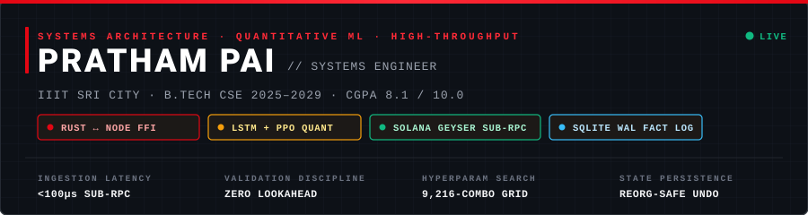
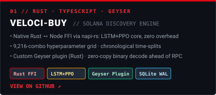
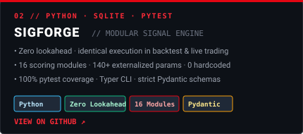
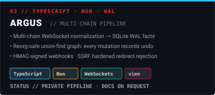
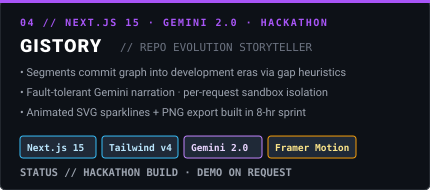

<!-- BRUTALIST EDITORIAL — PRATHAM PAI — SYSTEMS ENGINEER -->
<!-- Palette: PAPER #FFFCF8 / INK #0A0A0A / VERMILION #E30613 / EMERALD #10B981 / AMBER #F59E0B / SLATE #52525B -->

<div align="center">

<!-- HERO MASTHEAD (SELF-HOSTED VECTOR ASSET) -->
<picture>
  <source media="(prefers-color-scheme: dark)" srcset="./assets/hero-dark.svg" />
  <source media="(prefers-color-scheme: light)" srcset="./assets/hero-light.svg" />
  
</picture>

<br/>

<table width="100%" cellpadding="0" cellspacing="0" border="0">
  <tr>
    <td align="left" width="50%">
      <sub><b>PRATHAM PAI</b> &nbsp;&#183;&nbsp; HIGH-THROUGHPUT NATIVE SYSTEMS &nbsp;&#183;&nbsp; QUANTITATIVE ML</sub>
    </td>
    <td align="right" width="50%">
      <sub>
        <a href="https://linkedin.com/in/pratham-pai-47ba81375"></a> &nbsp;
        <a href="mailto:prathamgpai@gmail.com"></a> &nbsp;
        <a href="https://github.com/prathampai-college"></a> &nbsp;
        <a href="https://github.com/PrathamPai-2007"></a>
      </sub>
    </td>
  </tr>
</table>

</div>

<hr/>

<!-- 01 — MANIFESTO -->
### 01 — MANIFESTO

<table width="100%" cellpadding="0" cellspacing="0">
  <tr>
    <td width="56%" valign="top">

### **Architecting systems where native performance meets mathematical rigor.**

I build streaming engines that beat RPC, scoring pipelines with zero lookahead bias, and state layers that survive chain reorgs. Rust for throughput, TypeScript for orchestration, Python for validation — all measured against chronological, not shuffled, truth.

-  **Custom Geyser Plugin** with zero-copy binary decode  
-  **16-Signal Modular Engine**, 140+ externalized params, 0 hardcoded values  
-  **LSTM + PPO Pipeline** with 9,216-combo grid search on chronological splits  

<br/>

<sub>
  <a href="https://linkedin.com/in/pratham-pai-47ba81375"><b>↗ LINKEDIN</b></a> &nbsp;&nbsp; 
  <a href="mailto:prathamgpai@gmail.com"><b>↗ EMAIL</b></a> &nbsp;&nbsp; 
  <a href="https://github.com/prathampai-college"><b>↗ GITHUB</b></a> &nbsp;&nbsp; 
  <a href="https://github.com/PrathamPai-2007"><b>↗ ARCHIVE</b></a>
</sub>

</td>
    <td width="44%" valign="top">

| FACT FILE — PRATHAM PAI |  |
| :--- | ---: |
| **NAME** | **Pratham Pai** |
| **INSTITUTION** | **IIIT Sri City** |
| **DEGREE** | **B.Tech CSE ’25–’29** |
| **CGPA** | **8.1 / 10.0** |
| **FOCUS** | **Systems / Quant ML / Streaming** |

```rust
struct Engineer {
  name: "Pratham Pai",
  focus: [
    "Rust ↔ Node FFI (napi-rs)",
    "LSTM + PPO, walk-forward",
    "Geyser · WAL · WebSockets",
    "Next.js 15 · Tailwind v4",
  ],
}
```

</td>
  </tr>
</table>

<sub>**ASK ME ABOUT** — Concurrency patterns &#183; Rust &#8596; Node FFI &#183; Walk-Forward validation &#183; WebSocket feeds &#183; SQLite WAL internals</sub>

<hr/>

<!-- 02 — INDEX / ARSENAL -->
### 02 — INDEX / ARSENAL

| CATEGORY | STACK &amp; TECHNOLOGIES |
| :--- | :--- |
| **LANGUAGES** | <a href="https://www.rust-lang.org"></a> <a href="https://www.typescriptlang.org"></a> <a href="https://www.python.org"></a> <a href="https://developer.mozilla.org/en-US/docs/Web/JavaScript"></a> <a href="https://dev.java"></a> |
| **SYSTEMS &amp; LOW-LATENCY** |  <a href="https://bun.sh"></a> <a href="https://solana.com"></a> <a href="https://sqlite.org"></a>   |
| **QUANT &amp; MACHINE LEARNING** |    <a href="https://ai.google.dev"></a>  |
| **WEB &amp; FULLSTACK** | <a href="https://nextjs.org"></a> <a href="https://react.dev"></a> <a href="https://tailwindcss.com"></a> <a href="https://www.framer.com/motion"></a> <a href="https://supabase.com"></a> |
| **DEV &amp; INFRASTRUCTURE** | <a href="https://git-scm.com"></a> <a href="https://kernel.org"></a> <a href="https://github.com/features/actions"></a> <a href="https://docs.pytest.org"></a> <a href="https://docs.pydantic.dev"></a>  |

<br/>

<div align="center">
  <sub><em>— Raw concrete, no gloss. One accent, zero gradients. —</em></sub><br/><br/>
  <picture>
    <source media="(prefers-color-scheme: dark)" srcset="https://skillicons.dev/icons?i=rust,ts,python,bun,nextjs,tailwind,supabase,githubactions,solidity,pytorch,sqlite,linux&theme=dark&perline=12" />
    <source media="(prefers-color-scheme: light)" srcset="https://skillicons.dev/icons?i=rust,ts,python,bun,nextjs,tailwind,supabase,githubactions,solidity,pytorch,sqlite,linux&theme=light&perline=12" />
    
  </picture>
</div>

<hr/>

<!-- 03 — SELECTED WORKS -->
### 03 — SELECTED WORKS

<table width="100%" cellpadding="8" cellspacing="0" border="0">
  <tr>
    <!-- 01 Veloci-Buy -->
    <td width="50%" valign="top" align="center">
      <a href="https://github.com/PrathamPai-2007/veloci-buy">
        <picture>
          <source media="(prefers-color-scheme: dark)" srcset="./assets/card-veloci-buy-dark.svg" />
          <source media="(prefers-color-scheme: light)" srcset="./assets/card-veloci-buy-light.svg" />
          
        </picture>
      </a>
    </td>
    <!-- 02 SigForge -->
    <td width="50%" valign="top" align="center">
      <a href="https://github.com/PrathamPai-2007/sigforge">
        <picture>
          <source media="(prefers-color-scheme: dark)" srcset="./assets/card-sigforge-dark.svg" />
          <source media="(prefers-color-scheme: light)" srcset="./assets/card-sigforge-light.svg" />
          
        </picture>
      </a>
    </td>
  </tr>
  <tr>
    <!-- 03 Argus -->
    <td width="50%" valign="top" align="center">
      <picture>
        <source media="(prefers-color-scheme: dark)" srcset="./assets/card-argus-dark.svg" />
        <source media="(prefers-color-scheme: light)" srcset="./assets/card-argus-light.svg" />
        
      </picture>
    </td>
    <!-- 04 Gistory -->
    <td width="50%" valign="top" align="center">
      <picture>
        <source media="(prefers-color-scheme: dark)" srcset="./assets/card-gistory-dark.svg" />
        <source media="(prefers-color-scheme: light)" srcset="./assets/card-gistory-light.svg" />
        
      </picture>
    </td>
  </tr>
</table>

<hr/>

<!-- 04 — TELEMETRY -->
### 04 — TELEMETRY

<div align="center">

<table border="0" cellpadding="8" cellspacing="0">
  <tr>
    <td align="center" valign="top">
      <picture>
        <source media="(prefers-color-scheme: dark)" srcset="https://github-readme-stats-eight-theta.vercel.app/api?username=prathampai-college&show_icons=true&bg_color=0D1117&title_color=E30613&text_color=F0F6FC&icon_color=E30613&border_color=30363D&hide_border=false&count_private=true&include_all_commits=true&cache_seconds=3600" />
        <source media="(prefers-color-scheme: light)" srcset="https://github-readme-stats-eight-theta.vercel.app/api?username=prathampai-college&show_icons=true&bg_color=FFFCF8&title_color=E30613&text_color=0A0A0A&icon_color=E30613&border_color=E7E5E4&hide_border=false&count_private=true&include_all_commits=true&cache_seconds=3600" />
        
      </picture>
    </td>
    <td align="center" valign="top">
      <picture>
        <source media="(prefers-color-scheme: dark)" srcset="https://github-readme-stats-eight-theta.vercel.app/api/top-langs/?username=prathampai-college&layout=compact&bg_color=0D1117&title_color=E30613&text_color=F0F6FC&border_color=30363D&hide_border=false&cache_seconds=3600" />
        <source media="(prefers-color-scheme: light)" srcset="https://github-readme-stats-eight-theta.vercel.app/api/top-langs/?username=prathampai-college&layout=compact&bg_color=FFFCF8&title_color=E30613&text_color=0A0A0A&border_color=E7E5E4&hide_border=false&cache_seconds=3600" />
        
      </picture>
    </td>
  </tr>
</table>

<picture>
  <source media="(prefers-color-scheme: dark)" srcset="https://streak-stats.demolab.com?user=prathampai-college&background=0D1117&border=30363D&stroke=30363D&ring=E30613&fire=E30613&currStreakLabel=E30613&sideLabels=8B949E&currStreakNum=F0F6FC&sideNums=F0F6FC&dates=8B949E&card_width=820" />
  <source media="(prefers-color-scheme: light)" srcset="https://streak-stats.demolab.com?user=prathampai-college&background=FFFCF8&border=E7E5E4&stroke=E7E5E4&ring=E30613&fire=E30613&currStreakLabel=E30613&sideLabels=52525B&currStreakNum=0A0A0A&sideNums=0A0A0A&dates=52525B&card_width=820" />
  
</picture>

</div>

<hr/>

<!-- 05 — FIGURE -->
### 05 — FIGURE 01 / CONTRIBUTION MATRIX

<div align="center">
  <sub>RAW CONTRIBUTION GRID — PAPER DOTS &#183; VERMILION TRACE &#183; INK FIELD</sub>
  <br/><br/>
  <picture>
    <source media="(prefers-color-scheme: dark)" srcset="./assets/github-contribution-grid-snake-dark.svg" />
    <source media="(prefers-color-scheme: light)" srcset="./assets/github-contribution-grid-snake.svg" />
    
  </picture>
  <br/>
  <sub>FIG. 01 — Generated via <code>Platane/snk</code> &#183; palette: <code>#E30613</code> trace on concrete</sub>
</div>

<hr/>

<!-- COLOPHON -->
<div align="left">

<table width="100%" cellpadding="0" cellspacing="0" border="0">
  <tr>
    <td align="left">
      <sub><b>COLOPHON</b> &#183; SET IN IBM PLEX MONO &#183; PAPER #FFFCF8 &#183; INK #0A0A0A &#183; SIGNAL #E30613 &#183; EDITORIAL BRUTALISM &#183; 2026</sub>
    </td>
    <td align="right">
      <sub>
        <a href="https://linkedin.com/in/pratham-pai-47ba81375">LINKEDIN</a> &nbsp;·&nbsp;
        <a href="mailto:prathamgpai@gmail.com">EMAIL</a> &nbsp;·&nbsp;
        <a href="https://github.com/PrathamPai-2007">ARCHIVE</a> &nbsp;·&nbsp;
        <a href="https://github.com/prathampai-college">SOURCE</a>
      </sub>
    </td>
  </tr>
</table>

<sub>&#169; 2026 PRATHAM PAI — BUILT FOR CHRONOLOGICAL TRUTH. NO GRADIENTS. NO GLOW. JUST CONCRETE.</sub>

</div>

<hr/>
